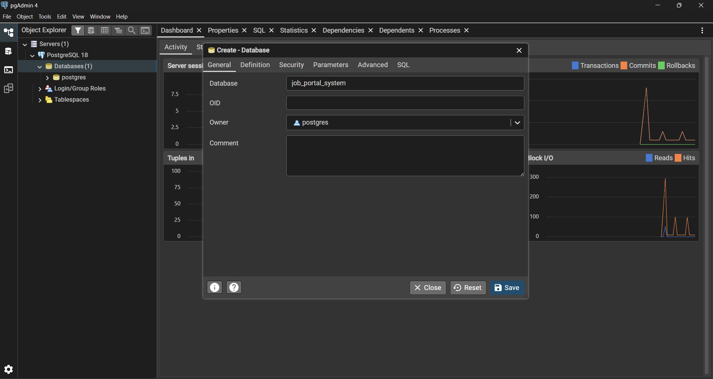

# UAS PAW Kelompok 2
Anggota Kelompok


## Setup project di local.
1. Install python, nodejs, postgresql.
- https://www.python.org/ftp/python/3.14.0/python-3.14.0-amd64.exe
- https://nodejs.org/dist/v25.2.1/node-v25.2.1-x64.msi
- https://sbp.enterprisedb.com/getfile.jsp?fileid=1259824

2. Clone repository ini
```bash
git clone https://github.com/andika-123140096/uas-paw-kelompok2
```

3. Masuk ke folder project
```bash
cd uas-paw-kelompok-2
```

4. Lakukan instalasi untuk frontend
```bash
cd frontend
npm install
```

5. Lakukan instalasi untuk backend
```bash
cd backend
python -m venv .venv
pip install --upgrade pip setuptools
pip install -e .
```

6. Bikin database menggunakan pgAdmin4. Nama databasenya ```job_portal_system```


## Run server di local

### Frontend
Open folder ini di vscode. Buka terminal
```bash
npm run dev
```
Buka http://localhost:5173/

### Backend
Open folder ini di vscode. Buka terminal
```bash
pserve development.ini
```
Buka http://127.0.0.1:6543

